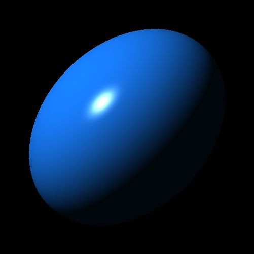

# Chapter 6



# Chapter 5


# Chapter 4


# Chapter 2


# Chapter 1

```
$ node dist/src/ts/index.js
Projectile position: (0.00, 1.00, 0.00)
Projectile position: (0.71, 1.71, 0.00)
Projectile position: (1.40, 2.31, 0.00)
Projectile position: (2.09, 2.82, 0.00)
Projectile position: (2.77, 3.23, 0.00)
Projectile position: (3.44, 3.54, 0.00)
Projectile position: (4.09, 3.74, 0.00)
Projectile position: (4.74, 3.85, 0.00)
Projectile position: (5.38, 3.86, 0.00)
Projectile position: (6.00, 3.76, 0.00)
Projectile position: (6.62, 3.57, 0.00)
Projectile position: (7.23, 3.28, 0.00)
Projectile position: (7.83, 2.89, 0.00)
Projectile position: (8.41, 2.39, 0.00)
Projectile position: (8.99, 1.80, 0.00)
Projectile position: (9.56, 1.11, 0.00)
Projectile position: (10.11, 0.31, 0.00)
Projectile position: (10.66, -0.58, 0.00)
Done in 0.15s.
```
